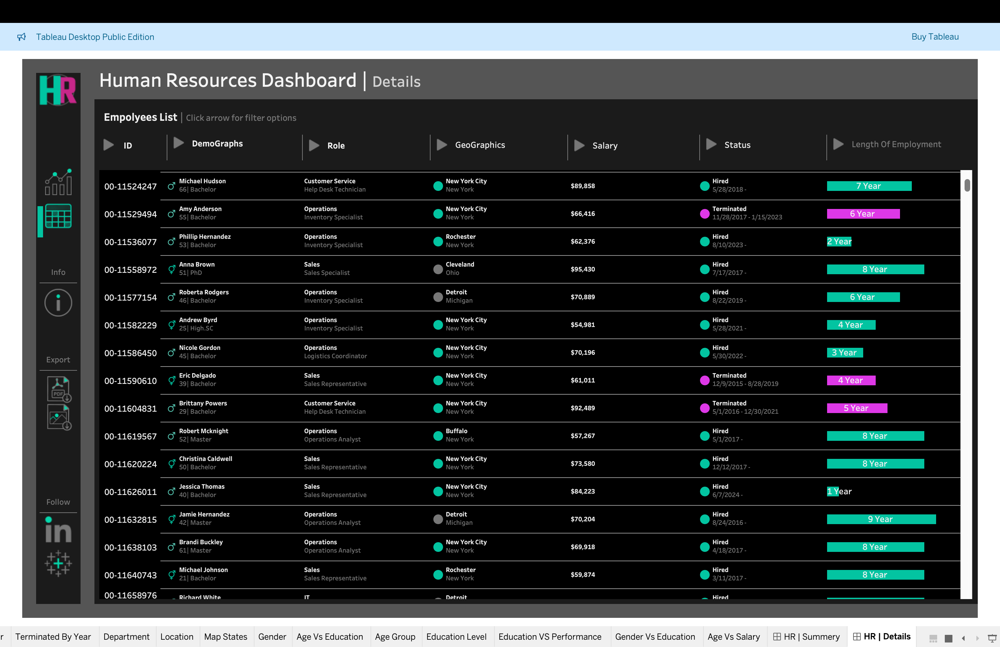
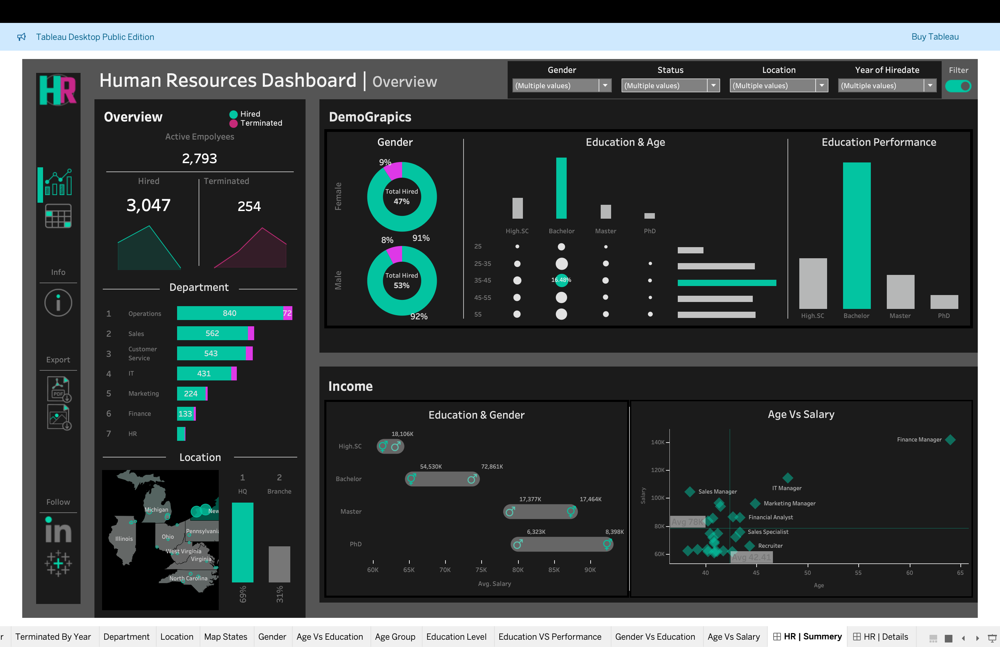
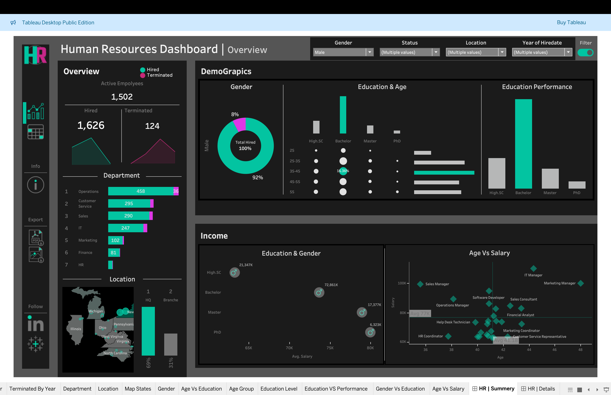
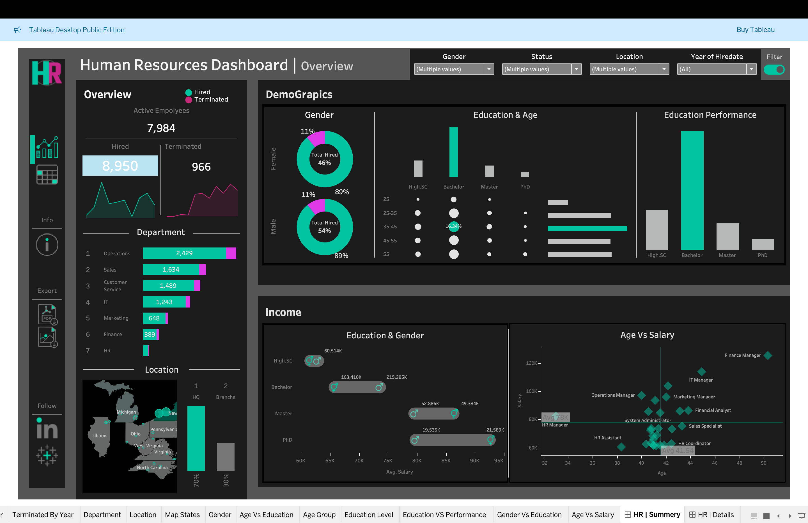
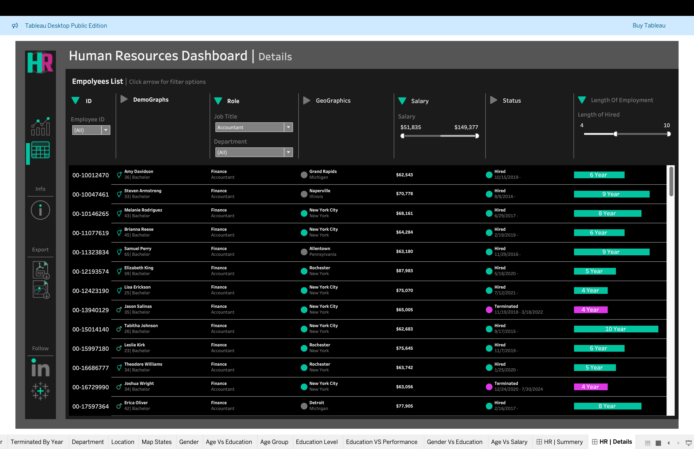
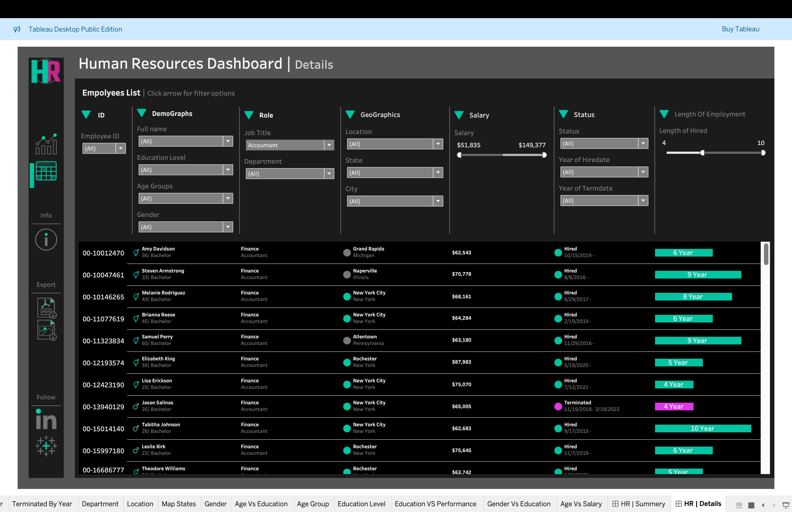
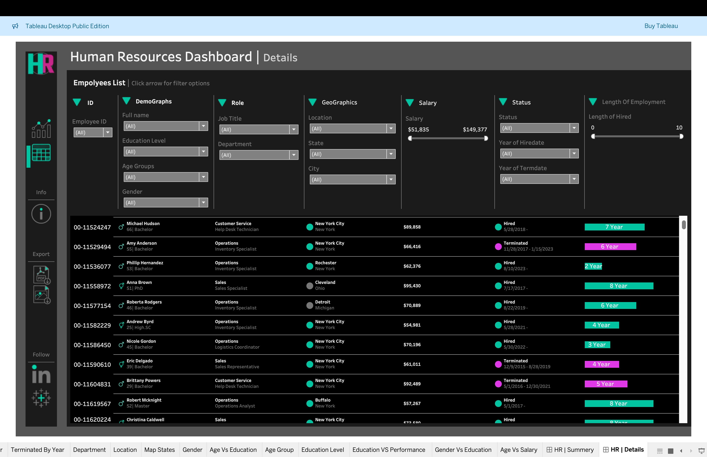

# 📊 HR Dashboard – Summary & Detailed Insights

An interactive HR Dashboard project built using **Tableau** and **Excel** that provides comprehensive insights into workforce data. This project showcases both summary and detailed analytics to help HR teams make informed, data-driven decisions.

---

## 📌 Overview

This project transforms raw HR data into powerful visualizations using Tableau. It includes:

- ✅ **Summary Dashboard** – High-level KPIs and workforce metrics  
- 🔍 **Detailed Dashboard** – In-depth views of attrition, job roles, gender diversity, and more

Both dashboards are designed for interactivity and clarity, offering valuable insights at a glance or through detailed filters.

---

## 🧰 Tools Used

- **Tableau** – Data visualization and dashboard development  
- **Microsoft Excel** – Data cleaning and transformation  
- **GitHub** – Version control and project sharing  

---

## 🌐 Live Dashboard

View the full interactive dashboard here:  
🔗 [Tableau Public – HR Dashboard](https://public.tableau.com/views/FinalHRProject_17500909538910/HRSummery?:language=en-US&:sid=&:redirect=auth&:display_count=n&:origin=viz_share_link)

---

## 🖼️ Dashboard Previews

### 📌 Summary Dashboard  


### 🔍 Detailed Dashboard  


### 👥 Gender & Department Breakdown  


### 📈 Attrition Over Time  


### 🧑‍💼 Job Roles & Satisfaction  


### ⏳ Employee Tenure  


### 🧮 Overall KPIs  


---

## 🔍 Key Insights

- 📌 Department-wise headcount and distribution  
- 🔁 Attrition and retention trends  
- 💼 Job role satisfaction levels  
- 🚻 Gender and diversity analytics  
- 📊 Tenure, experience, and performance indicators  

---

## 🚀 Getting Started

1. Clone this repository:
   ```bash
   git clone https://github.com/OverStarData/HR-Analytics-Dashboard.git
## 📫 Contact

- 📧 Email: [mahmoudkamal20518@gmail.com](mahmoudkamal20518@gmail.com)  
- 💼 LinkedIn: [LinkedIn]([https://www.linkedin.com/in/your-profile](https://www.linkedin.com/in/mahmoud-kamal-14208136b/))
